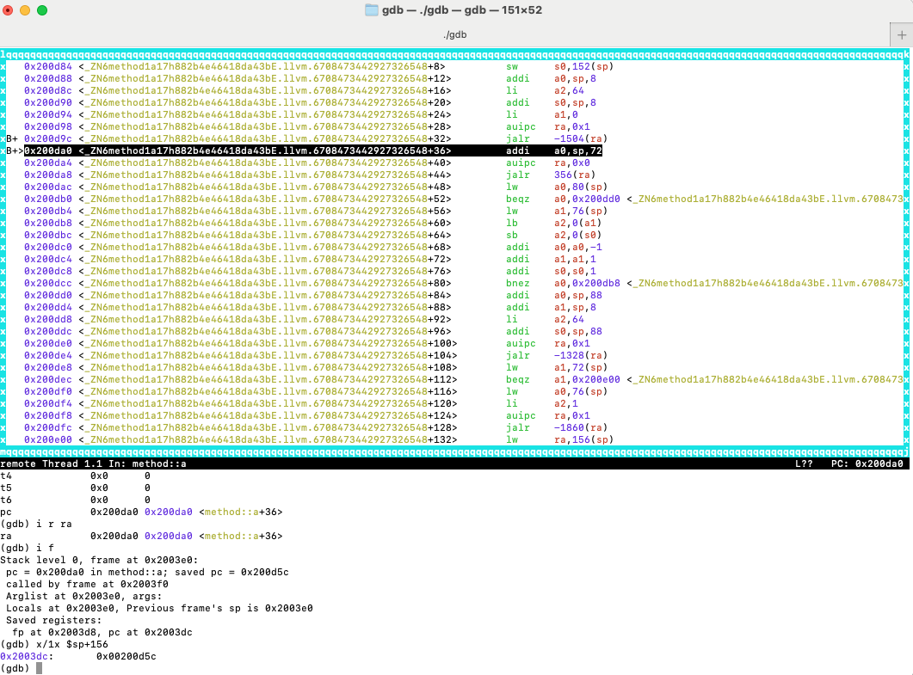

# Standalone VM and GDB stub for RISC Zero guest programs


This repository implements two things:

- a virtual machine for RISC Zero guest programs that runs RISC-V instructions and mimics RISC Zero's syscalls
- a debugger that implements an interface to GDB
- an optional bridge to RISC Zero's current native executor for compatibility checks

The debugger supports a large number of features that GDB needs. It allows GDB to read the ELF file, which is 
helpful if the symbol tables are present, set software breakpoints, set hardware watchpoints, single-step,
and access memory and registers. At the same time, one can also see how many cycles are used, how many pages
are loaded or unloaded.

We have not yet implemented reverse single-step and continue, which would allow 
GDB to go back in time but add some complexity due to the need to revert an instruction.

## Current RISC Zero compatibility status

This project was originally written for a much older RISC Zero release. The
standalone VM now has a compatibility layer for RISC Zero `5.0.0-rc.1`
syscall/register ABI changes, including current software syscall IDs, current
host ecalls, the current `MAX_IO_BYTES` limit, modern register windows, and the
current SHA2/Poseidon2/BigInt2 paths.

There is also a native-executor bridge:

```console
$ cargo run -- --native-smoke
$ cargo run -- --native-gdb
```

`--native-smoke` wraps a raw user ELF with RISC Zero's current v1compat kernel
and constructs `risc0_zkvm::ExecutorImpl`. This works for current RISC Zero
ELFs; for example, the packaged `risc0-zkvm-5.0.0-rc.1/examples/loop.bin`
halts successfully. The historical checked-in `code` ELF is old enough that it
enters the current native executor but fails in the current v1compat kernel with
`Illegal trap in machine mode`, so the standalone compatibility VM is still the
useful path for that artifact.

The focused syscall drift check is:

```console
$ bash scripts/verify-syscalls.sh
```

It compares local syscall numbers, `SYS_*` names, ecall constants, host ecall
constants, fd constants, and related limits directly against the current RISC
Zero crates.

## Find a GDB implementation that works for RISC-V

You need a GDB that understands 32-bit RISC-V ELF files and the RISC-V register
set. On Linux, `gdb-multiarch` is usually the easiest option.

On macOS with Apple Silicon, the situation has improved since this README was
first written: Homebrew now provides a bottled
[`riscv64-elf-gdb`](https://formulae.brew.sh/formula/riscv64-elf-gdb)
package for Apple Silicon. See [gdb_macOS_arm.md](gdb_macOS_arm.md) for the
current macOS notes.

Common options:

- On macOS:
  ```console
  $ brew install riscv64-elf-gdb
  ```
- On Ubuntu:
  ```console
  $ sudo apt install gdb-multiarch
  ```
- From source, build GDB with RISC-V target support if you need a pinned or
  custom build.

With `riscv64-elf-gdb`, tell GDB to use the 32-bit RISC-V architecture before
connecting:

```gdb
(gdb) set architecture riscv:rv32
(gdb) file code
(gdb) target remote 127.0.0.1:9000
```

The GDB manual's RISC-V remote target description expects the integer registers
`x0` through `x31` plus `pc`, with ABI aliases such as `ra`, `sp`, and `a0`
allowed. See the
[GDB RISC-V target-feature documentation](https://sourceware.org/gdb/current/onlinedocs/gdb.html/RISC_002dV-Features.html)
for the upstream register model.

### What about LLDB?

LLDB has improved: on current Apple LLDB, `target create --arch riscv32 code`
recognizes the checked-in ELF as `riscv32`. LLDB also speaks the GDB remote
protocol via `gdb-remote`; upstream LLDB documents its GDB-remote behavior, and
the [LLVM 20 release notes](https://releases.llvm.org/20.1.0/docs/ReleaseNotes.html)
include additional RISC-V LLDB improvements.

However, LLDB is not yet a drop-in replacement for this debugger. A local test
with Apple LLDB `2100.0.17.108` can connect to this repository's GDB stub and
see a stopped thread, but it does not provide useful register/frame inspection;
`register read pc` fails after connecting. For now, use GDB for actual
debugging. Treat LLDB as experimental unless you are also working on LLDB
remote-protocol compatibility for this stub.

## New RISC-Zero-specific functions for GDB

Interactions with GDB is similar to using GDB to debug another RISC-V program. But, this debugger implements additional 
API that is specific to RISC Zero, in that it can query the current cycle count as well as verbose information about the 
cycle information.

The first function retrieves the current session cycle.
```gdb
(gdb) mo c (short for "monitor cycle")
20838
```

The second function provides a verbose explanation about the segments and cycles.
```gdb
(gdb) mo v (short for "monitor verbose")
0 segments finished, current segment has taken 20838 cycles, 10 pages are loaded, 6 pages need to be stored
```

## Get RISC Zero to include debug information

If the guest is compiled with `RISC0_BUILD_DEBUG=1`, RISC Zero Rust compiler will include very useful debug information, 
which allows GDB to know—for example—the line of the code in the source file that an instruction belongs to.

```gdb
(gdb) b *0x200d18 (short for "break *0x200d18")
Breakpoint 1 at 0x200d18: file src/ttfhe/poly.rs, line 21.
```

Since GDB knows the line of code, it is able to show the source code side by side, as long as the source files are available to GDB. 
This should be the case if you are running GDB in the same machine. 

If you are running GDB in a guest VM, such as what we do for Metal 
chips, additional efforts are needed to mount the host to the guest. See [gdb_macOS_arm.md](gdb_macOS_arm.md) for how to do.

Note that `RISC0_BUILD_DEBUG=1` may turn off optimization, which would make the program very slow. To address that issue, modify the 
Cargo.toml file in the guest directory with the following profile configurations.
```toml
[profile.dev] 
opt-level = 3 

[profile.dev.build-override] 
opt-level = 3
```

## Simple cheatsheet for GDB

For a general cheatsheet, check out https://darkdust.net/files/GDB%20Cheat%20Sheet.pdf. 

Below we share some common steps in debugging a RISC Zero guest program.

By default, the debugger opens a port at 9000 and waits for GDB to connect. One can tell GDB to connect to this port.
```gdb
(gdb) tar rem 127.0.0.1:9000 (short for "target remote 127.0.0.1:9000")
```

One can first tell GDB to demangle the symbols.
```gdb
(gdb) set p as on (short for "set print asm-demangle on")
```

To find functions to manipulate, one can query a list of functions in the ELF files.
```gdb
(gdb) i fu (short for "info functions")
```

To get a user-friendly interface, one can turn on the Text User Interface (TUI). 
```gdb
(gdb) la a (short for "layout asm")
```

If source files are available, it is a better idea to show the source code alongside.
```gdb
(gdb) la sp (short for "layout split")
```

One can read all the registers.
```gdb
(gdb) i r (short for "info registers")
```

Or, look at a specific register, such as `ra` for return address.
```gdb
(gdb) i r ra  (short for "info registers ra")
```

One can set a breakpoint at a specific instruction or a function (with name from "info functions").
```gdb
(gdb) b *0x00200d7c (short for "break *0x00200d7c", important to have "*")
(gdb) b method::a (short for "break method::a", in which the function head would be skipped)
```

A watchpoint allows the GDB to be alarmed when certain memory area is being read or written. 
```gdb
(gdb) wa $sp+156 (short for "watch $sp+156", and here $sp is the stack pointer)
```

To view the function frames, one can ask GDB to show it.
```gdb
(gdb) i f (short for "info frame")
```

One can let GDB manipulate the memory or registers (even if it is PC) of the running program.
```gdb
(gdb) set $pc=0x00200f00
```

To view certain area of the memory, one can query it from GDB.
```gdb
(gdb) x/4x $sp+156 
```

If you need to convert between hex and dec during debugging, GDB also has it. 
```gdb
(gdb) p/x 2102980 (short for "print/x 2102980")
(gdb) p 0x002016c4 (short for "print 0x002016c4")
```

One who is familiar with PHP should realize that "$" sign starts a variable.
```gdb
(gdb) set $ra_tmp_store=0x2003dc
(gdb) p $ra_tmp_store
```

Lastly, don't forget how to close GDB.
```gdb
(gdb) q (short for "quit")
```

## Examples

The present code uses the `code` challenge file from https://github.com/weikengchen/zkctf-r0.
Below is a screenshot of the GDB that executes over it.



The unsolved challenge would trigger a memory error because it tries to write to memory location
at 0x1. This is not permissible for two reasons: (1) not aligned and (2) out of the guest memory.

```
Error message: execution encounters an exception at 0x00200f00. AlignmentFault(1)
Target terminated with signal EXC_BAD_ACCESS - Could not access memory!
```

Contestants for that catch-the-flag competition would need to avoid this exception.

## Credits and License

Most of the code for the virtual machine comes from RISC Zero (https://www.github.com/risc0/risc0). 

Most of the code for the debugger comes from gdbstub (https://github.com/daniel5151/gdbstub).

One can refer to [LICENSE](./LICENSE) for the resultant situations about licensing.
