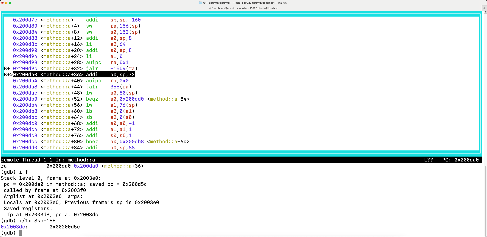

# Standalone VM and GDB stub for RISC Zero guest programs


This repository implements two things:
- a virtual machine for RISC Zero guest programs that runs RISC-V instructions and mimics RISC Zero's syscalls
- a debugger that implements an interface to GDB

The debugger supports a large number of features that GDB needs. It allows GDB to read the ELF file, which is 
helpful if the symbol tables are present, set software breakpoints, set hardware watchpoints, single-step, 
and access memory and registers. At the same time, one can also sees how many cycles are used, how many pages 
are loaded or unloaded.

We have not yet implemented reverse single-step and continue, which would allow 
GDB to go back in time but add some complexity due to the need to reverting an instruction. 

## Find a GDB implementation that works for RISC-V

If you are using macOS with ARM chips, please refer to [gdb_macOS_arm.md](gdb_macOS_arm.md).

Otherwise, chances are that GDB would work, but just requiring a good version of GDB that 
supports 32-bit RISC-V. An out-of-the-box GDB likely does not support 32-bit RISC-V, but just a few other 
very common architectures. 

There are two ways to obtain a collaborative GDB.

- On Ubuntu systems, one can install `gdb-multiarch`, which supports a large number of target platforms including
  32-bit RISC-V
- Compile GDB from the source (https://www.sourceware.org/gdb/) and do `./configure --target=riscv32` to obtain a
  dedicated GDB that only has 32-bit RISC-V

## New RISC-Zero-specific functions for GDB

Interactions with GDB is similar to using GDB to debug another RISC-V program. But, this debugger implements additional 
API that is specific to RISC Zero, in that it can query the current cycle count as well as verbose information about the 
cycle information.

The first function retrieves the current session cycle.
```gdb
(gdb) mo c (short for "monitor cycle")
20838
```

The second function provides a verbose explanation about the segments and cycles.
```gdb
(gdb) mo v (short for "monitor verbose")
0 segments finished, current segment has taken 20838 cycles, 10 pages are loaded, 6 pages need to be stored
```

## Simple cheatsheet for GDB

For a general cheatsheet, check out https://darkdust.net/files/GDB%20Cheat%20Sheet.pdf. 

Below we share some common steps in debugging a RISC Zero guest program.

By default, the debugger opens a port at 9000 and waits for GDB to connect. One can tell GDB to connect to this port.
```gdb
(gdb) tar rem 127.0.0.1:9000 (short for "target remote 127.0.0.1:9000")
```

One can first tell GDB to demangle the symbols.
```gdb
(gdb) set p as on (short for "set print asm-demangle on")
```

To find functions to manipulate, one can query a list of functions in the ELF files.
```gdb
(gdb) i fu (short for "info functions")
```

To get a user-friendly interface, one can turn on the Text User Interface (TUI). 
```gdb
(gdb) la a (short for "layout asm")
```

One can read all the registers.
```gdb
(gdb) i r (short for "info registers")
```

Or, look at a specific register, such as `ra` for return address.
```gdb
(gdb) i r ra  (short for "info registers ra")
```

One can set a breakpoint at a specific instruction or a function (with name from "info functions").
```gdb
(gdb) b *0x00200d7c (short for "break *0x00200d7c", important to have "*")
(gdb) b method::a (short for "break method::a", in which the function head would be skipped)
```

A watchpoint allows the GDB to be alarmed when certain memory area is being read or written. 
```gdb
(gdb) wa $sp+156 (short for "watch $sp+156", and here $sp is the stack pointer)
```

To view the function frames, one can ask GDB to show it.
```gdb
(gdb) i f (short for "info frame")
```

One can let GDB manipulate the memory or registers (even if it is PC) of the running program.
```gdb
(gdb) set $pc=0x00200f00
```

To view certain area of the memory, one can query it from GDB.
```gdb
(gdb) x/4x $sp+156 
```

If you need to convert between hex and dec during debugging, GDB also has it. 
```gdb
(gdb) p/x 2102980 (short for "print/x 2102980")
(gdb) p 0x002016c4 (short for "print 0x002016c4")
```

One who is familiar with PHP should realize that "$" sign starts a variable.
```gdb
(gdb) set $ra_tmp_store=0x2003dc
(gdb) p $ra_tmp_store
```

Lastly, don't forget how to close GDB.
```gdb
(gdb) q (short for "quit")
```

## Examples

The present code uses the `code` challenge file from https://github.com/weikengchen/zkctf-r0. 
Below is a screenshot of the GDB that executes over it.



The unsolved challenge would trigger a memory error because it tries to write to memory location
at 0x1. This is not pemissible for two reasons: (1) not aligned and (2) out of the guest memory.

```
Error message: execution encounters an exception at 0x00200f00. AlignmentFault(1)
Target terminated with signal EXC_BAD_ACCESS - Could not access memory!
```

Contestants for that catch-the-flag competition would need to avoid this exception.

## Credits and License

Most of the code for the virtual machine comes from RISC Zero (https://www.github.com/risc0/risc0). 

Most of the code for the debugger comes from gdbstub (https://github.com/daniel5151/gdbstub).

One can refer to [LICENSE](./LICENSE) for the resultant situations about licensing.

